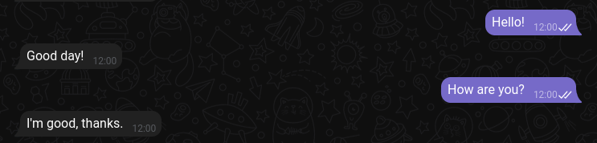
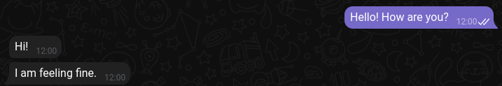
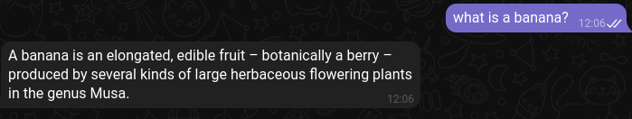
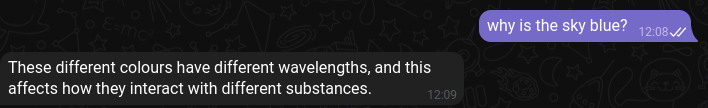

# ExMachine2120-Bot

An inteligent chatbot that uses NLP, it can search on Google, Wikpedia for detailed responses.
This project uses some NLP libraries like: nlp.js and compromise.
And some web scrapping libraries like: axios, html-parser, wikijs and googleIt.
Currently it only works on Telegram, on the future it will work on Discord.

## Examples
### Simple question answering

### Multiple sentences answering

### Search on Wikpedia

### Search on Google

## How does this work?
- First the bot recieve an input text, example "Hello! How are you?"
- And then the bot split the text in sentences ["Hello!", "How are you?]
- The bot interprets each sentence intent with a brain classifier, so the first sentence will match the intent "Greeting" and the second will match the intent "ask.state", these intents are defined on ./common/corpus.json
- With these intents, for each sentence will execute the bot logic of the intent, the default bot logic is defined on : ./- - common/defaultbotlogic.js
- And finally, the bot will return outputs for each sentence

